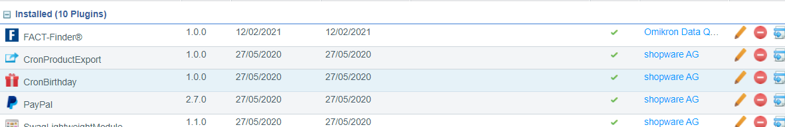
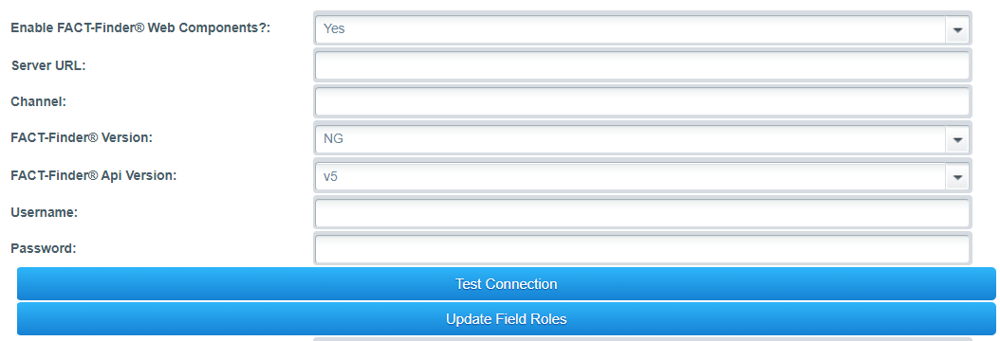

# FACT-Finder® Web Components for Shopware 5

This document helps you to integrate the FACT-Finder® Web Components SDK into your Shopware5 Shop. In addition, it gives a
concise overview of its primary functions. The first chapter *Installation* walks you through the suggested installation
process. The second chapter *Settings* explains the customisation options in the Shopware5 backend. The
 final chapter *Exporting Feed* describes how to use provided console command to export the feed.


- [Requirements](#requirements)
- [Installation](#installation)
- [Activating the Module](#activating-the-module)
- [Settings](#settings)
    - [Test Connection Button](#test-connection-button)
    - [Using FACT-Finder® on category pages](#using-fact-finder-on-category-pages)
    - [Upload Settings](#upload-settings)
    - [Import Settings](#import-settings)
    - [Single Fields](#single-fields)
- [Exporting Feed](#exporting-feed)
- [Adding New Column To Feed](#adding-new-column-to-feed)
- [Contribute](#contribute)
- [License](#license)


## Requirements
- Shopware 5.5 or higher
- PHP version 7.1 or higher


## Installation

To install the module, open your terminal and run the command:

    composer require omikron/shopware5-factfinder




## Activating the Module
Once the module is activated, you can find the configurations page under `Configuration->PluginManager`.
All sections will be covered in the following paragraphs.


## Settings


This section contains a module configuration, which is required in order for the module to work.
All fields are self-explained.
Configuration set here is used by both Web Components and during the server side communication with FACT-Finder® instance.
Credentials you will be given should be placed here.

* Server URL - FACT-Finder® instance url   
  **Note:** Server URL should contain a used protocol: (e.g. `https://`) and should end with an endpoint ( `fact-finder` )
* Channel - Channel you want to serve data from
* Username
* Passwo  **Note:** Module supports FACT-Finder® NG only.
  
rd  
  **Note:** Module supports FACT-Finder® NG only.
  
### Test Connection Button
By clicking the `Test Connection` button, you can check if your credentials are correct.
This functionality uses form data, so there is no need to save first.
**Note:** This functionality uses main sub shop channel input value.

### Using FACT-Finder® on category pages
Render category pages with FACT-Finder®. Categories URLs and hence SEO will still use standard Shopware routing.
Once the user lands on a category page, a search event is immediately emitted (thanks to `search-immediate` communication
parameter usage) with the corresponding category filter applied.

### Upload Options
Following settings are used for uploading already exported feed to a given FTP server.
**Note:** FTP server should be configured to listen on default port 21

* FTP host  
  **Note:** Please enter the host only, without the used protocol
* FTP user
* FTP password

### Import options
You can configure the module to trigger FACT-Finder® import after the feed is uploaded to the configured FTP server. 
* Import data after export? - Enable/disable import
* Import data types - define import types which should be triggered. Possible types are: Suggest, Search and Recommendation

### Single Fields
This setting allows you to select existing product attributes to be exported in a separated columns.
Additional data transformations are performed on the data of one of these types:
* BOOLEAN
* DATETIME
* FLOAT

Free text fields of different type are exported in non changed form.
For the field with Entity type defined, it will export the Identifier of that entity.

## Exporting Feed
Feed export is available in the Shopware CLI application. You can run it by executing:

    php [SHOPWARE_ROOT]/bin/console factfinder:export:articles

The command can be run with an optional argument indicating the shop context ID that you are targeting.
The ID is an integer value.
    
    php [SHOPWARE_ROOT]/bin/console factfinder:export:articles 1

There are two additional options:
* `-u` uploads the feed to the configured FTP server after feed is generated.
* `-i` runs the FACT-Finder® import with previously uploaded feed  
  **Note:** This option works only in a combination with `-u` 
  
## Adding New Column To Feed
The standard feed contains all data FACT-Finder® requires to work.
However, you may want to export additional information which is relevant for your project and not part of a default
Shopware 5 installation. This section shows you how to extend the feed with additional column.

Start with creating field provider - a class implementing `OmikronFactfinder\Components\Data\Article\Fields\FieldInterface` which will be used to export your data.

```php
interface FieldInterface
{
    public function getName(): string;

    public function getValue(Detail $detail): string;
}
```

The method `getValue` contains your field logic and receives the article detail currently being exported.

```php
class CustomColumn implements FieldInterface
{
     public function getName(): string
     {
        return 'MyColumnName'; // Will be used as column header in the CSV feed
     }

    public function getValue(Detail $detail): string
    {
        // Implement logic to fetch and transform data for a given article detail  
    }
}
```

Once your additional column is defined, register it as a service using Symfony DI ([you can find more information
here][1]) and set them to be [auto-configured][2]. By doing this, your fields will be tagged as `factfinder.export.field` and
can be picked up automatically by our `FieldProvider`. Of course, autoconfiguration is just a convenience we offer,
you can still assign the tag to your service manually.

## Contribute
We welcome contribution! For more information, click [here](.github/CONTRIBUTING.md)

## License
FACT-Finder® Web Components License. For more information see the [LICENSE](LICENSE) file.

[1]: https://developers.shopware.com/developers-guide/services/#registering-the-service
[2]: https://symfony.com/doc/3.3/service_container.html#the-autoconfigure-option
